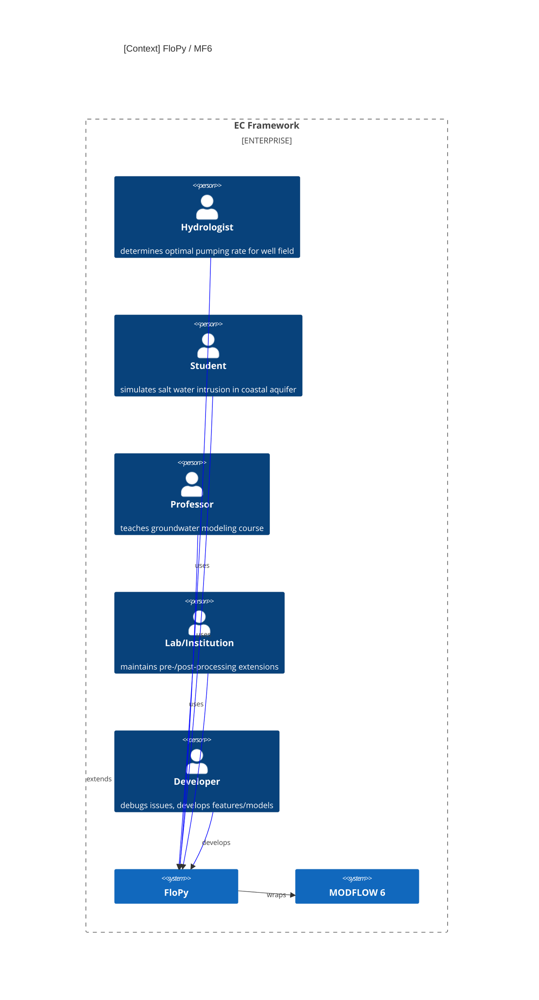
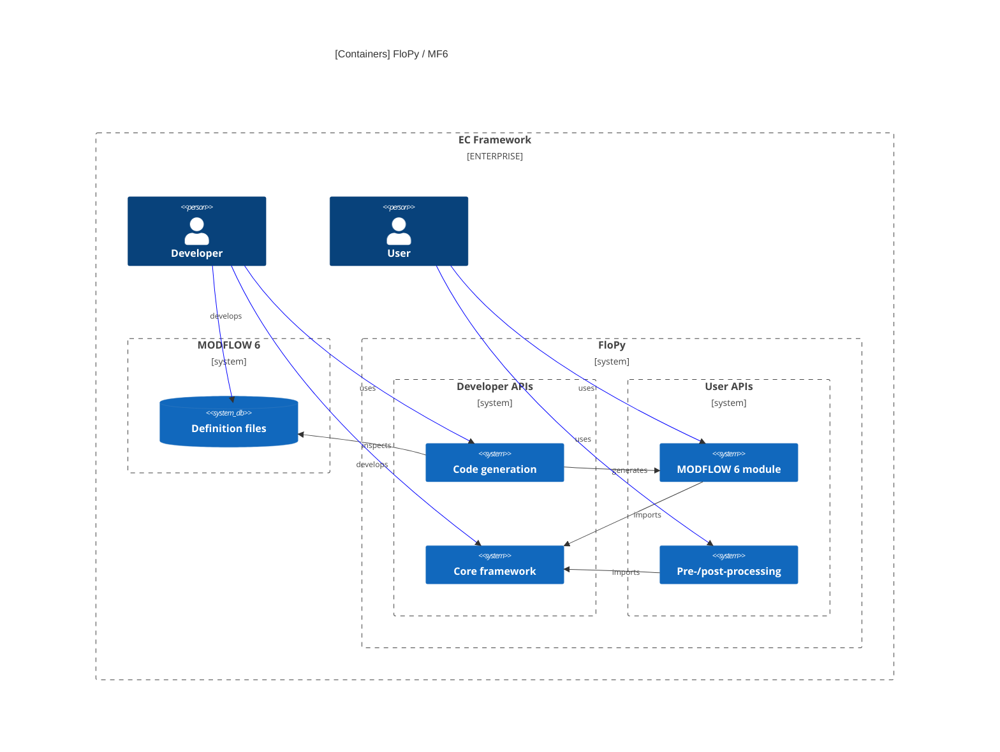
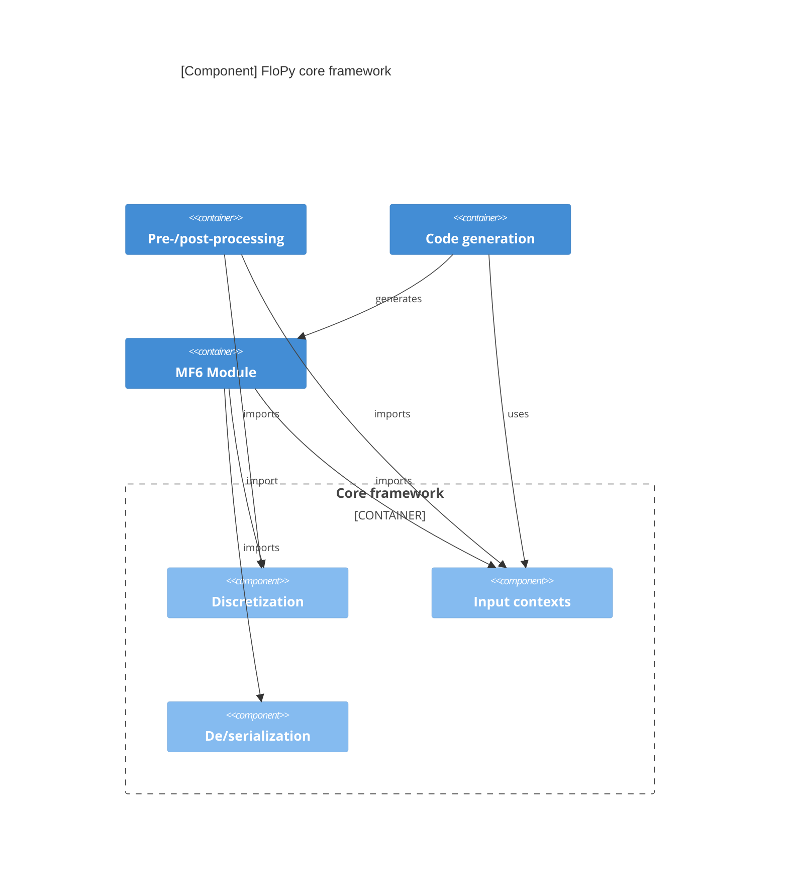
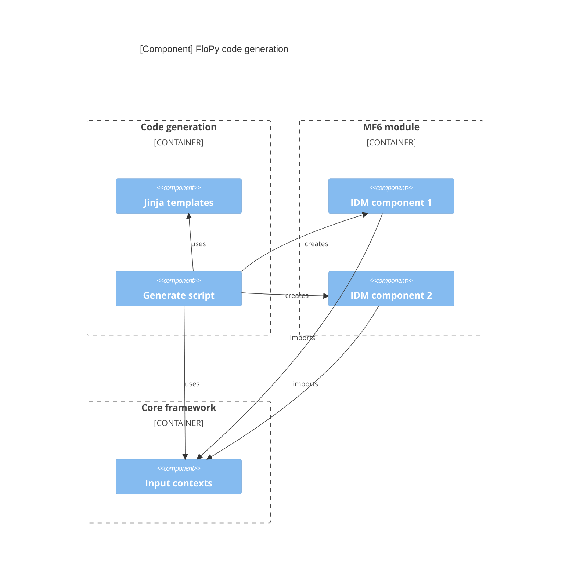

# FloPy C4 diagrams

Documenting prospective FloPy architecture.

```mermaid
C4Context
  title [Context] FloPy / MF6

  Enterprise_Boundary(ec, "EC Framework") {
    Person(hydrologist, "Hydrologist", "determines optimal pumping rate for well field")
    Person(student, "Student", "simulates salt water intrusion in coastal aquifer")
    Person(professor, "Professor", "teaches groundwater modeling course")
    Person(institution, "Lab/Institution", "maintains pre-/post-processing extensions")
    Person(developer, "Developer", "debugs issues, develops features/models")

    System(flopy, "FloPy")
    System(mf6, "MODFLOW 6")

    Rel(flopy, mf6, "wraps")
    Rel(hydrologist, flopy, "uses")
    Rel(student, flopy, "uses")
    Rel(professor, flopy, "uses")
    Rel(institution, flopy, "extends")
    Rel(developer, flopy, "develops")
    UpdateRelStyle(hydrologist, flopy, $lineColor="blue")
    UpdateRelStyle(student, flopy, $lineColor="blue")
    UpdateRelStyle(professor, flopy, $lineColor="blue")
    UpdateRelStyle(institution, flopy, $lineColor="blue", $offsetX="-190", $offsetY="10")
    UpdateRelStyle(developer, flopy, $lineColor="blue")

  }

```

```mermaid
C4Container
  title [Containers] FloPy / MF6

  Enterprise_Boundary(ec, "EC Framework") {

    Boundary(mf6, "MODFLOW 6"){
      SystemDb(dfn, "Definition files")
    }

    Boundary(flopy, "FloPy") {
      Boundary(devs, "Developer APIs") {
        System(fpycodegen, "Code generation")
        System(fpycore, "Core framework")
      }
      Boundary(users, "User APIs") {
          System(fpymf6, "MODFLOW 6 module")
          System(fpyprepost, "Pre-/post-processing")
      }
      Rel(fpymf6, fpycore, "imports")
      Rel(fpyprepost, fpycore, "imports")
    
      Rel(fpycodegen, dfn, "inspects")
      Rel(fpycodegen, fpymf6, "generates")
    }

    Person(dev, "Developer", "")
    Person(user, "User", "")

    Rel(dev, dfn, "develops")
    Rel(dev, fpycore, "develops")
    Rel(dev, fpycodegen, "uses")
    Rel(user, fpymf6, "uses")
    Rel(user, fpyprepost, "uses")
    UpdateRelStyle(dev, dfn, $lineColor="blue", $offsetX="-20" $offsetY="-30")
    UpdateRelStyle(dev, fpycore, $lineColor="blue", $offsetY="90")
    UpdateRelStyle(dev, fpycodegen, $lineColor="blue", $offsetY="50")
    UpdateRelStyle(user, fpymf6, $lineColor="blue", $offsetY="50")
    UpdateRelStyle(user, fpyprepost, $lineColor="blue", $offsetY="50")
    UpdateRelStyle(user, fpycore, $lineColor="blue", $offsetX="-20" $offsetY="-10")
  }

  UpdateLayoutConfig($c4ShapeInRow="5", $c4BoundaryInRow="5")
```

```mermaid
C4Component
  title [Component] FloPy core framework

  Container(fpyprepost, "Pre-/post-processing")
  Container(fpycodegen, "Code generation")
  Container(fpymf6, "MF6 Module")

  Container_Boundary(fpycore, "Core framework") {
    Component(dis, "Discretization")
    Component(idm, "Input contexts")
    Component(io, "De/serialization")
  }

  Rel(fpyprepost, dis, "imports")
  Rel(fpyprepost, idm, "imports")
  Rel(fpycodegen, idm, "uses")
  Rel(fpycodegen, fpymf6, "generates")
  Rel(fpymf6, dis, "import")
  Rel(fpymf6, idm, "imports")
  Rel(fpymf6, io, "imports")
```

```mermaid
C4Component
  title [Component] FloPy code generation

  Container_Boundary(fpycodegen, "Code generation") {
    Component(templates, "Jinja templates")
    Component(genscript, "Generate script")
  }

  Container_Boundary(fpymf6, "MF6 module") {
    Component(comp1, "IDM component 1")
    Component(comp2, "IDM component 2")
  }

  Container_Boundary(fpycore, "Core framework") {
    Component(ctx, "Input contexts")
  }

  Rel(genscript, templates, "uses")
  Rel(genscript, comp1, "creates")
  Rel(genscript, comp2, "creates")
  Rel(genscript, ctx, "uses")
  Rel(comp1, ctx, "imports")
  Rel(comp2, ctx, "imports")
```
