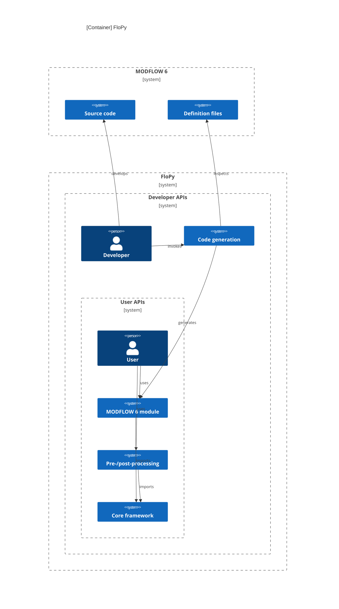

```mermaid
C4Context
  title [Container] FloPy

  Boundary(mf6, "MODFLOW 6"){
    System(src, "Source code",)
    System(dfn, "Definition files",)
  }

  Boundary(flopy, "FloPy") {

    Boundary(devs, "Developer APIs") {
      Person(dev, "Developer", "")
      System(fpycodegen, "Code generation")

      Boundary(users, "User APIs") {
          Person(user, "User", "")

          System(fpymf6, "MODFLOW 6 module")
          System(prepost, "Pre-/post-processing")
          System(core, "Core framework")

          Rel(user, fpymf6, "uses")
          Rel(user, prepost, "uses")
          Rel(fpymf6, core, "imports")
          Rel(prepost, core, "imports")
      }
    }

    Rel(dev, fpycodegen, "invokes")
    Rel(dev, src, "develops")
    Rel(fpycodegen, dfn, "inspects")
    Rel(fpycodegen, fpymf6, "generates")
  }

  UpdateLayoutConfig($c4ShapeInRow="2", $c4BoundaryInRow="1")
```