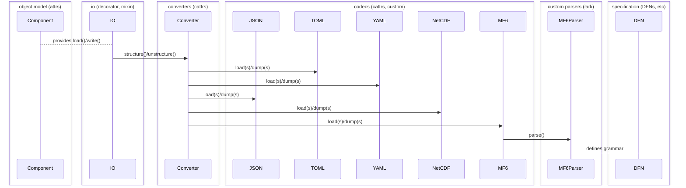

# FloPy 4 software design description (SDD)

<!-- START doctoc generated TOC please keep comment here to allow auto update -->
<!-- DON'T EDIT THIS SECTION, INSTEAD RE-RUN doctoc TO UPDATE -->

- [Principles](#principles)
- [Overview](#overview)
- [Runtime](#runtime)
- [Object model](#object-model)
  - [Plugin architecture](#plugin-architecture)
  - [Classes how?](#classes-how)
  - [Context trees](#context-trees)
  - [Dictionary mimicry](#dictionary-mimicry)
  - [Parameter definitions](#parameter-definitions)
  - [Code generation](#code-generation)
  - [Signals](#signals)
- [Data model](#data-model)
  - [Arrays](#arrays)
  - [Tables](#tables)
  - [Laziness](#laziness)
  - [Units](#units)
- [IO](#io)
  - [Overview](#overview-1)
  - [Unified IO](#unified-io)
  - [Converters](#converters)
  - [Codecs](#codecs)
  - [Parsers](#parsers)
- [Resources](#resources)

<!-- END doctoc generated TOC please keep comment here to allow auto update -->

This document drafts a design philosophy and architecture
for FloPy 4. This is a tentative document. A proof of
concept is underway.

## Principles

1. Separation of concerns

We want to avoid coupling FloPy's core framework to the MODFLOW 6 framework and
to the MODFLOW 6 input format. We want to separate abstract requirements, which
all hydrologic simulations might share, from details of the program's structure
and its expected input format. We want the same core framework to drive MODFLOW
6, MODFLOW 2005, LGR, NWT, GRIDGEN, etc &mdash; ideally any hydrologic simulator.

We also want to avoid polluting the core framework with post-processing details
like plotting, aggregations, input/output, etc.

IO, for instance, is at the boundary of an application and should only affect
the object model in rare instances.

*any more?*

## Overview

FloPy can consist of plugins, each defining a wrapper for a
given hydrologic program. Programs are expected to have well
defined input format specifications.

FloPy can generate an **object model** and **IO layer**
from these, building on an `attrs`-based core framework.
Once these exist, they *are* the specification &mdash;
specification documents should be derivable in reverse.

FloPy can provide a **simulation runtime** which accepts a
plugin and input configuration, potentially validates them,
then executes the program and makes its results available.

Custom input formats and other program details are isolated
in the plugin. The same engine runs them all.

## Runtime

Simulations as coroutines? Returning a simulation result
which gives easy access to results (and can be retrieved
easily from the simulation on demand). `flopy.run(...)`
or simular to start a run from an instance of simulation.
All runs can have an autogenerated GUID and a name, with
the name as GUID alone if the simulation is anonymous, or
the simulation's name followed by the GUID if it is named.

This will allow scheduling an arbitrary number of runs at
the same time; the interpreter will no longer block while
a simulation runs, with output captured if enabled.

We can also provide a traditional synchronous alternative
which runs the simulation directly.

## Object model

We want to offer a generic framework of building blocks for
hydrologic models, and for hydrologic model program plugins.

### Plugin architecture

A developer will first implement a plugin to support some
hydrologic model. An interface layer is autogenerated from
a declarative specification; minimal code is necessary for
basic functionality.

A model developer will interact with the plugin, using the
interface layer to construct a model, which the framework
can then run.

### Classes how?

Python has several ways to define composite data:
dictionaries, named tuples, standard classes, `dataclasses`.
The latter aims to make it easier to give a class
a nice `__repr__`, structural equality, etc.

We want a nice OO user interface providing both an input
specification and access to values as named attributes. This
can be achieved with `@dataclass` out of the box, the former
via `fields()`.

We also want things like:

- hierarchical namespacing
- context-aware parameters

...and more.

`dataclasses` is derived from an older project called
[`attrs`](https://www.attrs.org/en/stable/), which has
some extra powers, including hooks for validation or
transformations, easy introspection, and more.

### Context trees

The FloPy framework can provide a set of basic types for
the input object model and constituent parameters. The
former are nodes in a context tree, the latter leaves.
Each component must be able to resolve its location in
the tree; this will allow hierarchical addressing, as
is used for the MF6 memory manager. It may also inform
certain user-facing operations (for instance, a method
may work differently if a component is independent vs
an element in a simulation).

It is simply convenient to be able to ask a component:
what are you attached to? The component should be able
to display a tree showing its own position.

Perhaps a `Context` class which can
[hook into class initialization](https://www.attrs.org/en/stable/init.html#hooking-yourself-into-initialization)
to introspect its attributes and set up some machinery,
including parameter/component specification, signaling
apparatus for parameter dependencies (see below), and
more.

Peripheral concerns (e.g. plotting/exporting) can be
handled by mixins, so we can avoid polluting the core
classes and also avoid the diamond problem.

`Context` can offer nice string representations:
  - `__str__`  of object model **classes** as human-readable (possibly condensed) specification
  - `__repr__` of object model **classes** as exact specification
  - `__str__` of object model **instances** as human-readable (possibly condensed) contents
  - `__repr__` of object model **instances** as full, complete contents

Parent pointers might be implemented as weak references
to avoid memory leaks; e.g., if a component is removed
from a simulation and the simulation is descarded, then
we want the garbage collector to be free to collect it,
and we want a finalizer callback to set the component's
`parent` to None.

### Dictionary mimicry

Provide a low-level mixin `MapAttrs` to make an `attrs`-
based class act like a dictionary. This is convenient
for e.g. passing keyword arguments, and for potential
interop with 3rd-party libraries accepting dict-like
objects.

Sometimes one wants a parameter name which collides
with a reserved Python keyword. `MapAttrs` children
can name parameters with a leading underscore; then
set up a stripped alias for any parameter whose name
isn't reserved.

### Parameter definitions

Components can inherit from a `Context` class, which
implements `MapAttrs`. Components define parameters
with `param()`, which wraps `attrs.field()`, adding
some metadata:

- `description`: str
- `deprecated`: bool

Parameters are primitives or composites of primitives.

### Code generation

Generated files are currently version controlled
in FloPy 3.

Code generation is a developer task, which we do
immediately before each release, or when needed
for development/modification of MF6 components.

This has the benefit that Python source files for
the MF6 input model can be inspected in an editor.
The discipline required to update them in version
control is slightly burdensome.

We could consider moving this task to install time,
and removing Python source files from versioning.
This would preserve the ability to inspect them,
while removing the question about when to update
them.

We could ship the latest IO spec with each FloPy
release. Upon installation, FloPy would generate
components from this specification. Users could
use the existing developer tools to regenerate
them for a different specification if needed,
as is currently possible. Users could still
inspect the classes in an IDE, too.

We could consider splitting out a new command
just to retrieve an input specification: e.g.
`get_spec`. The existing `generate_classes`
command could simply generate source code.
We could combine these into a new command
`migrate` which is equivalent to the current
behavior of `generate_classes`.

A final option is to generate an object model
entirely dynamically, without any source files
This may present debugging challenges. If we go
this route, an informative `repr()` becomes even
more critical, as it will be the only way to get
the specification from an object model class
(besides of the course the documentation).

### Signals

Parameter constraints and other dependencies can
be implemented with the observer pattern.

At import time, a program's input model can look
at its parameters, determine their dependencies,
and subscribe dependents to their sources. When
a source parameter changes at runtime, its value
is broadcast to all listeners, which can run a
callback to modify their own values in response.

## Data model

The data model should be agnostic to any program.

As described above in the object model section: a
simulation is a context whose subcomponents may be
contexts as well. Each context may have components
(nested contexts) and parameters. A parameter is a
leaf in the context tree.

As mentioned above, a `Context` class implementing
`MapAttrs` can define its parameters with `param()`,
which wraps `attrs.field()`.

Parameters are Python primitives and collections of
primitives.

Parameters can be scalars, records, lists, arrays,
or tables.

Ideally a data model would be dependency-agnostic,
but we view NumPy and Pandas as de facto standard
library and accept them as array/table primitives.

If we ever need to provide array/table abstractions
of our own, we could take inspiration from
[astropy](https://github.com/astropy/astropy).

We define a record as a context which can have no
subcomponents, only parameters. We will consider
this a `Dict` for practical use, though it will
need implementing as an `attrs`-based class so
its parameter spec is discoverable at import
time if we go with `attrs`. If implemented with
`MapAttrs`, dictionary behavior comes for free.

A list can contain a single parameter type or a
union of such. Where the elements are unions, we
require they be records, as disambiguation is not
otherwise possible.

On this view, an MF6 keystring is a `typing.Union`
of various `Record`s.

FloPy can thus define a parameter as:

```python
from typing import Dict, List
from numpy.typing import ArrayLike
from pandas import DataFrame

Scalar = bool | int | float | str | Path
Record = Dict[str, Scalar]
List = List[Scalar | Record]
Array = ArrayLike
Table = DataFrame
Param = Scalar | Record | List | Array | Table
```

This is proposed as a general foundation onto which
it should be possible to map input specifications
for a broad range of programs, not only MODFLOW 6.

### Arrays

We can accept any `numpy.typing.ArrayLike` value,
whether a standard `ndarray` or some other flavor,
so long as it acts like an array.

We can implement `ArrayLike`s of our own if there is
a good case for it, e.g. constant or layered arrays:

- `ConstantArray`: store constant array as a scalar
- `LayeredArray`: convenient access to array layers

These can be factored out of the original `MFArray`
implementation.

### Tables

We can accept any `pd.DataFrame` (or subclass) as
tabular input.

We draw a sharp distinction between *regularly*
shaped (tabular) MF6 list input and unstructured
list input. We require these be distinguished by
type hints. The former can use `pandas` builtin
IO routines; the latter needs custom treatment.

### Laziness

We recognize a distinction between two types of
parameter: configuration and data. This isn't
always valid, but it can be useful: for example
we might consider scalars, records, and lists
configuration parameters, and load them eagerly
by default, while loading array and tabular data
only upon first access, unless the user requests
eager loading explicitly.

### Units

It may be worth considering support for units via e.g.
[pint](https://github.com/hgrecco/pint). Though units
are not required for MODFLOW simulations, they could
be passed through for informative purposes, and some
other programs may require them.

## IO

### Overview

From the [principles](#principles):

> IO... is at the boundary of an application and should only affect
the object model in rare instances.

Access to IO can be unified with a decorator or mixin applied to object model classes,
which accesses a global registry of supported output formats and de/encoding machinery.
Defaults can be configured at this level.

Format can also be configurable on a per-simulation basis, or at read/write time
via method parameters.

IO can thus be separated into several layers:

- An `io` class decorator (or mixin) which provides `load` and `write` methods
  to the object model
- `cattrs` converters to map the object model to/from scalar/container
  primitives (un/structuring)
- Encoders/decoders for any number of serialization formats, which translate
  primitives to strings
- Language specification and parser for custom encodings
  can be achieved with `lark`

<br/>



### Unified IO

A small set of class decorators could provide unified access to
IO for object model classes. Alternatively these could be mixins.

The decorator (or mixin) could manage access to a global registry
of converters, and make them available to object model `load()` /
`write()` methods taking a `format="..."` or similarly named argument.

To cleanly support external data files, we could consider noting 
them (maybe with a context manager) when `write()` is called on
context in which they appear, and only coming back to them once
all components in the hierarchy have written their own files.

Model output objects could consider aliasing `write()` to `export()`
for consistency with the current FloPy convention.

### Converters

We want to be able to check invariants on context initialization;
i.e., input model validation. We may also want to transform the
value of any particular parameter based on the values of other
parameters.

Validation and transformation can happen at conversion time: the
structuring (instantiating from Python primitives or containers)
and unstructuring (converting the back to builtins) of data, to
and from instances of the object model.

A `validator` or `converter` may be registered with `attrs`-based
class fields. We could define custom validators or converters to
e.g. constrain the shape of an array, or to try to slice it upon
a change in grid dimensions.

The core of this layer is a `cattrs.Converter`, each of which is
associated with some configuration language. We could define a
custom converter for the MF6 input format, wrapping a custom
codec (encoder/decoder) for the same.

We could also consider `pydantic` for validations/conversions.

### Codecs

A codec encodes Python primitives and containers to strings and
decodes strings into Python primitives and containers. The `json`
module in the standard library is a prominent example. We could
provide a custom codec for the MF6 input format. This requires
a custom parser, which (we have discovered) is cumbersome to
implement by hand.

### Parsers

In the initial proof of concept we had each component in
the object model parsing itself from text. There is much
wrong with this as discussed above, but another issue is
that doing it by hand is hard and error-prone.

An alternative to rolling our own backtracking recursive
descent parser is to define the MF6IO specification, and
let a [parser generator](https://en.wikipedia.org/wiki/Comparison_of_parser_generators)
make one for us. This is likely to perform better than a
custom implementation, and it forces us to make the input
specification precise.

We could define an ABNF or EBNF specification for the MF6
input format. This is done by other languages, e.g. TOML
https://github.com/toml-lang/toml/blob/1.0.0/toml.abnf.
A parser generator could consume this. One option might be 
[lark](https://lark-parser.readthedocs.io/en/latest/index.html).

## Resources

- https://docs.python.org/3/reference/datamodel.html?emulating-container-types=#emulating-generic-types
- https://docs.python.org/3/library/asyncio-task.html
- https://docs.python.org/3/library/weakref.html
- https://en.wikipedia.org/wiki/Observer_pattern
- https://www.attrs.org/en/stable/index.html#
- https://catt.rs/en/stable/index.html#
- https://docs.pydantic.dev/latest/
- https://threeofwands.com/why-i-use-attrs-instead-of-pydantic/
- https://code.djangoproject.com/wiki/DevModelCreation
- https://github.com/astropy/astropy: astronomy project, nicely designed core data structures and io layer
- https://github.com/pyinat/pyinaturalist/tree/main/pyinaturalist/models: attrs for a web API client
- https://numpy.org/doc/stable/user/basics.interoperability.html: numpy interop for custom array-likes
- https://github.com/lark-parser/lark
