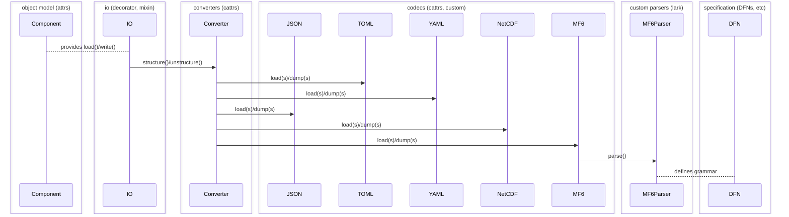

# FloPy 4 software design description (SDD)

<!-- START doctoc generated TOC please keep comment here to allow auto update -->
<!-- DON'T EDIT THIS SECTION, INSTEAD RE-RUN doctoc TO UPDATE -->

- [Principles](#principles)
- [Overview](#overview)
  - [Objects](#objects)
    - [Counting the ways](#counting-the-ways)
    - [Context resolution](#context-resolution)
    - [Dictionary mimicry](#dictionary-mimicry)
    - [Impedance mismatch](#impedance-mismatch)
  - [Parameters](#parameters)
    - [Arrays](#arrays)
    - [Tables](#tables)
    - [Lazies](#lazies)
    - [Signals](#signals)
    - [Units](#units)
  - [Code generation](#code-generation)
  - [IO](#io)
    - [Overview](#overview-1)
    - [Decorators](#decorators)
    - [Converters](#converters)
    - [Codecs](#codecs)
    - [Parsers](#parsers)
- [Resources](#resources)

<!-- END doctoc generated TOC please keep comment here to allow auto update -->

This document drafts a design philosophy and architecture
for FloPy 4. This is a tentative document. A proof of
concept is underway.

## Principles

1. Separation of concerns

We want to avoid coupling FloPy's core framework to the MODFLOW 6 framework and
to the MODFLOW 6 input format. We want to separate abstract requirements, which
all hydrologic simulations might share, from details of the program's structure
and its expected input format. We want the same core framework to drive MODFLOW
6, MODFLOW 2005, LGR, NWT, GRIDGEN, etc &mdash; ideally any hydrologic simulator.

We also want to avoid polluting the core framework with post-processing details
like plotting, aggregations, input/output, etc.

IO, for instance, is at the boundary of an application and should only affect
the object model in rare instances.

2. ...

## Overview

FloPy can provide a basic set of building blocks with
which MODFLOW 6 input parameters can be defined and
configured: **parameters** and **contexts** (groups
of parameters and possibly nested contexts).

Ideally, the input framework might be agnostic to the 
program it represents. This could make it possible to
support other programs with a consistent/unified API,
though that is not an immediate goal.

Provided an **input specification** for MF6, FloPy
can generate an object-oriented Python interface,
consisting of an **object model** (components of
the simulation and their input/output contexts)
and an **IO module** (data access layer).

Once these exist, an input specification should be
derivable from them in reverse.

A **runtime** can validate the configuration, run the
program, report its progress, and expose its results.

FloPy will support the MODFLOW 6 input language as well as
standard data interchange formats such such as JSON, TOML,
and YAML.

### Objects

Ideally, an object model might have

- a small core codebase and a largely autogenerated 
user-facing API

- consistent (and few) points of entry

- easy access to components' input specification

- easy access to components' current input data

- hierarchical namespacing and context-awareness

- validation capabilities, and a way to detect when a
simulation is "dirty": needing validation again after
parameters have changed.

#### Counting the ways

Python has several approaches to defining data classes:
dictionaries, named tuples, plain classes, `dataclasses`.
The latter aim to make it easier to give a class a nice
`__repr__`, structural equality, and other conveniences.

`dataclasses` is derived from an older project called
[`attrs`](https://www.attrs.org/en/stable/) which has
some extra powers, including hooks for validation and
transformation, introspection tools, and more.

Since `attrs` solves several of our problems at once,
we aim to prototype the core object model on it.

#### Context resolution

Each component must be able to resolve its location in
context. This will support hierarchical addressing, as
is used for the MF6 memory manager. It may also inform
certain user-facing operations (for instance, a method
may work differently if a component is independent vs
an element in a simulation). This should also help to
provide nice string representations.

It will be convenient to ask a component: what are you
attached to? The component should be able to produce a
tree showing its own position in context.

Parent pointers might be implemented as weak references
to avoid memory leaks; e.g., if a component is removed
from a simulation and the simulation is descarded, then
we want the garbage collector to be free to collect it,
with a finalization callback to set parent references
to `None`.


#### Dictionary mimicry

The dictionary is a ubiquitous data container, useful
for e.g. passing keyword arguments, and for potential
interop with 3rd-party libraries accepting dict-like
objects. It would be nice if object model components
could act like (or be easily convertible to) dicts.

#### Impedance mismatch

It is not always easy to convert a data source to/from
hierarchical data structures. In relational databases
this is called "object-relational impedance mismatch".

FloPy faces a similar challenge: we cannot assume that
programs will (and MF6 does not) specify input format
in, or read input from, a hierarchical configuration
language/file.

The MF6 DFN specification, for instance, consists of a
file for each component, each of which is a flat list
of parameters; an implicit parameter type hierarchy,
along with an attribute `in_record`, determine where
the parameter is situated in the input context (i.e.,
if it is part of record, or within a list). The block
membership structure is defined by `block` attributes.
This is akin to a single database table (imagining an
extra column `file_name` or similar, which identifies
the DFN file and the component it specifies).

From this, FloPy must generate a nested object model.
This means distinguishing scalars from composites, in
MF6's case, and in general, requires mapping an input
specification of arbitrary structure and content to a program-agnostic data model.

### Parameters

A **parameter** is a program input variable.

A parameter is a leaf in the **context**. A context
is a map of parameters and/or nested contexts. The
simulation is the root.

A parameter is a primitive value or a **composite**.

Primitive parameters are **scalar** (int, float, bool,
string, path), **array-like**, or **tabular**.

> [!NOTE]
> Ideally a data model would be dependency-agnostic,
but NumPy's array primitives are nearly universal.
If there is ever need to define array abstractions
of our own, we could take inspiration from
[astropy](https://github.com/astropy/astropy).

Composite parameters are **record** and **union**
(product and sum, respectively) types, as well as
**lists** of records.

A record is a tuple of scalar parameters.

The data model can be specified roughly as:

```python
from typing import Dict, List
from numpy.typing import ArrayLike
from pandas import DataFrame


Scalar = Union[bool, int, float, str, Path]
Record = Tuple[Scalar, ...]
Array = ArrayLike
Table = DataFrame
Param = Union[Scalar, Array, Table, Record]
```

An MF6 keystring can be represented as a union of
records. Period blocks are lists of record unions.
Most packages' `packagedata` block, on the other
hand, are tabular (regularly shaped), and can be
represented with a `DataFrame`.

TODO: how to specify the table schema/dtypes?

A nested hierarchy of `attrs`-based classes can
form the context tree and composite parameters,
though records are simply tuples (and contexts
dictionaries) from a serializer's perspective.

It should be possible to map input specifications
for a wide range of programs onto this foundation,
not only MODFLOW 6.

#### Arrays

We can accept any `numpy.typing.ArrayLike` value,
whether a standard `ndarray` or some other flavor,
so long as it acts like an array.

We can implement `ArrayLike`s of our own if there is
a good case for it, e.g. constant or layered arrays:

- `ConstantArray`: store constant array as a scalar
- `LayeredArray`: convenient access to array layers

These can be factored out of the original `MFArray`
implementation.

#### Tables

We can accept any `pd.DataFrame` (or subclass) as
tabular input.

We draw a sharp distinction between *regularly*
shaped (tabular) MF6 list input and unstructured
list input. We require these be distinguished by
type hints. The former can use `pandas` builtin
IO routines; the latter needs custom treatment.

We can store parameter specification information
in the `DataFrame.attrs` property or by way of
[custom accessors](https://pandas.pydata.org/pandas-docs/stable/development/extending.html#registering-custom-accessors).

#### Lazies

We recognize a distinction between two types of
parameter: configuration and data. This isn't
always valid, but it can be useful: for example
we might consider scalars and standalone records
configuration parameters, and load them eagerly
by default, then load array, lists, and tables
only on first access, unless the user requests
eager loading.

#### Signals

Parameter constraints and other dependencies can
be implemented with the observer pattern.

At import time, a program's input model can look
at its parameters, determine their dependencies,
and subscribe dependents to their sources. When
a source parameter changes at runtime, its value
is broadcast to all listeners, which can run a
callback to modify their own values in response.

`attrs` provides hooks which may make this kind
of class customization fairly straightforward.

#### Units

It may be worth considering support for units via e.g.
[pint](https://github.com/hgrecco/pint). Though units
are not required for MODFLOW simulations, they can be
passed through for purposes ofdocumentation, and some
other programs may require them.

### Code generation

Generated files are currently version controlled
in FloPy 3.

Code generation is a developer task, which we do
immediately before each release, or when needed
for development/modification of MF6 components.

This has the benefit that Python source files for
the MF6 input model can be inspected in an editor.
The discipline required to update them in version
control is slightly burdensome.

We could consider moving this task to install time,
and removing Python source files from versioning.
This would preserve the ability to inspect them,
while removing the question about when to update
them.

We could ship the latest IO spec with each FloPy
release. Upon installation, FloPy would generate
components from this specification. Users could
use the existing developer tools to regenerate
them for a different specification if needed,
as is currently possible. Users could still
inspect the classes in an IDE, too.

We could consider splitting out a new command
just to retrieve an input specification: e.g.
`get_spec`. The existing `generate_classes`
command could simply generate source code.
We could combine these into a new command
`migrate` which is equivalent to the current
behavior of `generate_classes`.

A final option is to generate an object model
entirely dynamically, without any source files
This may present debugging challenges. If we go
this route, an informative `repr()` becomes even
more critical, as it will be the only way to get
the specification from an object model class
(besides of the course the documentation).

### IO

#### Overview

From the [principles](#principles):

> IO... is at the boundary of an application and should only affect
the object model in rare instances.

Access to IO can be unified with a decorator or mixin applied to object model classes,
which accesses a global registry of supported output formats and de/encoding machinery.
Defaults can be configured at this level.

Format can also be configurable on a per-simulation basis, or at read/write time
via method parameters.

IO can thus be separated into several layers:

- An `io` class decorator (or mixin) which provides `load` and `write` methods
  to the object model
- `cattrs` converters to map the object model to/from scalar/container
  primitives (un/structuring)
- Encoders/decoders for any number of serialization formats, which translate
  primitives to strings
- Language specification and parser for custom encodings
  can be achieved with `lark`

<br/>



#### Decorators

A small set of class decorators could provide unified access to
IO for object model classes. Alternatively these could be mixins.

The decorator (or mixin) could manage access to a global registry
of converters, and make them available to object model `load()` /
`write()` methods taking a `format="..."` or similarly named argument.

To cleanly support external data files, we could consider noting 
them (maybe with a context manager) when `write()` is called on
context in which they appear, and only coming back to them once
all components in the hierarchy have written their own files.

Model output objects could consider aliasing `write()` to `export()`
for consistency with the current FloPy convention.

#### Converters

A unified IO layer can interact with lower-level IO routines via
a **conversion** layer. Conversion is structuring (instantiation
from Python primitives or containers) and unstructuring (mapping
back to Python builtins) of the object model from and to generic
data structures.

The core of this layer is a `cattrs.Converter`, each of which is
associated with some configuration language. We could define a
custom converter for the MF6 input format, wrapping a custom
codec (encoder/decoder; see below).

We want to be able to check invariants on context initialization;
i.e., input model validation. We may also want to transform the
value of any particular parameter based on the values of other
parameters. Conversion time is a suitable contest for validation
and transformation.

A `validator` or `converter` may be registered with `attrs`-based
class fields. We could define custom validators or converters to
e.g. constrain the shape of an array, or to try to slice it upon
a change in grid dimensions.

Alternatively we could consider `pydantic` for this functionality.

#### Codecs

A codec encodes Python primitives and containers to strings and
decodes strings into Python primitives and containers. The `json`
module in the standard library is a prominent example. We could
provide a custom codec for the MF6 input format. This requires
a custom parser, which (we have discovered) is cumbersome to
implement by hand.

#### Parsers

In the initial proof of concept we had each component in
the object model parsing itself from text. There is much
wrong with this as discussed above, but another issue is
that doing it by hand is hard and error-prone.

An alternative to rolling our own backtracking recursive
descent parser is to define the MF6IO specification, and
let a [parser generator](https://en.wikipedia.org/wiki/Comparison_of_parser_generators)
make one for us. This is likely to perform better than a
custom implementation, and it forces us to make the input
specification precise.

We could define an ABNF or EBNF specification for the MF6
input format. This is done by other languages, e.g. TOML
https://github.com/toml-lang/toml/blob/1.0.0/toml.abnf.
A parser generator could consume this. One option might be 
[lark](https://lark-parser.readthedocs.io/en/latest/index.html).

## Resources

- https://docs.python.org/3/reference/datamodel.html?emulating-container-types=#emulating-generic-types
- https://docs.python.org/3/library/asyncio-task.html
- https://docs.python.org/3/library/weakref.html
- https://en.wikipedia.org/wiki/Observer_pattern
- https://www.attrs.org/en/stable/index.html#
- https://catt.rs/en/stable/index.html#
- https://docs.pydantic.dev/latest/
- https://threeofwands.com/why-i-use-attrs-instead-of-pydantic/
- https://code.djangoproject.com/wiki/DevModelCreation
- https://github.com/astropy/astropy: astronomy project, nicely designed core data structures and io layer
- https://github.com/pyinat/pyinaturalist/tree/main/pyinaturalist/models: attrs for a web API client
- https://numpy.org/doc/stable/user/basics.interoperability.html: numpy interop for custom array-likes
- https://github.com/lark-parser/lark
- https://en.wikipedia.org/wiki/Hierarchical_database_model
- https://en.wikipedia.org/wiki/Object_model
- https://en.wikipedia.org/wiki/Object%E2%80%93relational_impedance_mismatch
