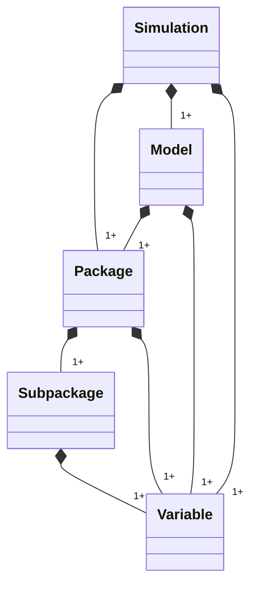

# FloPy 4 software design description (SDD)

<!-- START doctoc generated TOC please keep comment here to allow auto update -->
<!-- DON'T EDIT THIS SECTION, INSTEAD RE-RUN doctoc TO UPDATE -->


- [Conceptual model](#conceptual-model)
- [Object model](#object-model)
  - [Design](#design)
  - [Conventions](#conventions)
- [IO](#io)
  - [Input](#input)
    - [Unified IO](#unified-io)
    - [Conversion](#conversion)
    - [Serialization](#serialization)
      - [Writer](#writer)
      - [Reader](#reader)
  - [Output](#output)

<!-- END doctoc generated TOC please keep comment here to allow auto update -->

This is the Software Design Description (SDD) document for FloPy 4, also called *the product*.

This document describes a tentative design, focusing on functional requirements. Some attention may be given to architecture, but non-functional requirements are largely out of scope.

## Conceptual model

This document follows MODFLOW 6 terminology where applicable, with modifications/translations where appropriate.

A MODFLOW 6 simulation is as a hierarchy of modular **components**. Components encapsulate related data and functionality.

Components may have zero or more user-specified **variables** &mdash; the product calls these **field**, as the latter is more conventional in the Python world. A field might be a numeric parameter, e.g. a scalar or array value, or a configuration value. Fields which configure non-numerical features of the simulation are called **options**. A field may or may not be mandatory.

The fundamental component flavors are

- **simulation**: MF6's "unit of work", consisting of 1+ models, possibly coupled
- **model**: a simulated hydrological process, possibly coupled to others
- **package**: a subcomponent of a simulation, model, or package

The simulation is the root of a tree whose internal nodes are models and whose leaves are packages. A package is not necessarily a leaf; packages may have packages as children.

Most components have only one possible parent (e.g., models are children of the simulation), but some relax this requirement.

There are several special kinds of package, not necessarily mutually exclusive.

- A **stress package** represents a forcing
- A **basic package** contains only input variables applying statically to the entire simulation
- An **advanced package** contains time-varying input variables
- A **subpackage** is a package whose parent is another package


```mermaid
classDiagram
    Simulation *-- "1+" Package
    Simulation *-- "1+" Model
    Simulation *-- "1+" Variable
    Model *-- "1+" Package
    Model *-- "1+" Variable
    Package *-- "1+" Subpackage
    Package *-- "1+" Variable
    Subpackage *-- "1+" Variable
```

Components are specified by **definition files**. A definition file specifies a single component and its fields. A definition file consists of top-level metadata and **blocks** (named collections) of variables. A component may contain zero or more blocks. Each block must contain at least one variable. Most components will have a block named "options" &mdash; see the [MODFLOW 6 DFN file specification](https://modflow6.readthedocs.io/en/latest/_dev/dfn.html) for more info.

## Object model

The product's main use cases include creating, manipulating, running, and inspecting MODFLOW 6 simulations. It is natural to provide an object-oriented interface in which every MF6 component module will generally have a corresponding class.

There are many ways to implement an object model in Python: dictionaries, named tuples, plain classes, `dataclasses`, etc.

Two requirements in particular motivate the design described below: 1) the object model is a tree, and 2) it must be self-describing.

Component classes must provide access to both **specification** and **data** &mdash; form and content, respectively. A component's specification should be legible from its class definition, to people and programs.

Moreover, MODFLOW 6 components are situated in a hierarchy, with the simulation at the root, a branch for each model, and so on for packages, etc. This is true of both specification and data &mdash; the specification tree defines how components may be connected together, while a simulation instantiates some subset of the specification.

A third motivation is consistency with [`imod-python`](https://github.com/Deltares/imod-python), which the product follows in several ways including:

- Using [`xarray`](https://docs.xarray.dev/en/stable/index.html) for the underlying data model
- Providing dictionary-style access and modification

Components in `imod-python` encode parent/child relations in a dictionary, which is filtered as needed for subcomponents of a particular type. The structure of a simulation (or of any component with respect to its children) is thus flexible. "Structural" checks (i.e., what may be attached to what?) run in a separate validation step.

The product aims instead for typed components, where children can be read off the class definition. This pulls structural validation from runtime to type-checking time, so invalid arrangements are visible in e.g. IDEs with Intellisense.

### Design

The product adopts the standard library `dataclasses` paradigm for class definitions. The `dataclasses` module is derived from a project called [`attrs`](https://www.attrs.org/en/stable/) with [more power](https://threeofwands.com/why-i-use-attrs-instead-of-pydantic/). `attrs` permits terse class definitions, e.g.

```python
from flopy.mf6.gwf import Ic
from attrs import define, field
from numpy.typing import NDArray
import numpy as np

@define
class Ic(Package):
    """Initial conditions package"""
    strt: NDArray[np.float64] = field(...)
    export_array_ascii: bool = field(...)
    export_array_netcdf: bool = field(...)
```

Minimal class definitions are easier to read and to generate from definition files. The trick is in mapping the MODFLOW 6 input specification to the Python type system. With this transformation defined, the original specification can be derived in reverse from the class definition.

The product bolts on dictionary-style behavior by implementing `MutableMapping` in a component base class.

Where `imod-python` components expose their fields via [a `Dataset`](https://github.com/Deltares/imod-python/blob/master/imod/common/interfaces/ipackagebase.py), components in the product expose a `DataTree` node. The [`DataTree`](https://docs.xarray.dev/en/stable/generated/xarray.DataTree.html) is a recently developed `xarray` feature implementing [a hierarchical data store](https://docs.xarray.dev/en/stable/user-guide/hierarchical-data.html). Components in the product are an [experimental hybrid](https://github.com/wpbonelli/xattree) of `attrs` and `xarray` where `attrs` properties, as well as parent/child references, are proxied through the `DataTree`.

Combining `attrs` and `xarray` in this way presents challenges involving duplication (`xarray` prefers copies to in-place updates) and synchronization. Some careful management of parent/child links is still required, even though `DataTree` does the majority of the work.

The sparse, record-based list input format used by MODFLOW 6 is also in some tension with `xarray`, where it is natural to disaggregate tables into an array for each constituent column &mdash; this requires a nontrivial mapping between data as read from input files and the values eventually accessible through `xarray` APIs.

### Conventions

Being based on `xarray`, the product can support the [MODFLOW 6 NetCDF specification](https://github.com/MODFLOW-ORG/modflow6/wiki/MODFLOW-NetCDF-Format) via `xarray` extension points: custom indices and accessors.

Different "views" of the same underlying components may be provided for each relevant convention through these extension points.

The product can define a custom index and accessor (e.g. `.grid`) providing a structured grid specification. The product can adopt the [`xugrid` library](https://github.com/Deltares/xugrid) for UGRID support.

While custom indices will enable indexing and selection directly on datasets, the accessors can provide utilities for plotting, export, etc. For instance, `xugrid` provides a [`.to_netcdf()` function](https://deltares.github.io/xugrid/api/xugrid.UgridDatasetAccessor.to_netcdf.html). Selecting the scheme in which to write simulation input files then reduces simply to calling `.to_netcdf()` through the appropriate accessor.

## IO

IO is at the product's boundary. Details of any input or output format should not be coupled to the object model.

### Input

Input file IO is implemented in three layers:

1. **Unified IO layer**: Registry and descriptors implementing `load` and `write` methods on the base `Component` class
2. **Conversion layer**: Uses `cattrs` to map the object model to/from Python primitives and containers (i.e. un/structuring)
3. **Serialization layer**: Format-specific encoders/decoders translating primitives and containers to/from strings or binary data

#### Unified IO

The `flopy4.uio` module provides a pluggable IO framework adapted from [`astropy`](https://github.com/astropy/astropy/tree/main/astropy/io). A global `Registry` maintains mappings from `(component_class, format)` pairs to load and write functions. The `Component` base class implements user-facing `load` and `write` methods via descriptors which dispatch functions in the registry.

Loaders and writers can be registered for any component class and format. The registry supports inheritance: a loader/writer registered for a base class is available to all subclasses. The user may then select a format at call time.

#### Conversion

The conversion layer uses `cattrs` to transform between the product's `xarray`/`attrs`-based object model and plain Python data structures suitable for serialization. This layer is format-agnostic and handles structural transformations common across formats.

**Unstructuring (write time)**: A `cattrs` converter with appropriate unstructuring hooks converts components to a form suitable for serialization, handling transformations like:

- Grouping fields into blocks according to their `block` metadata from DFNs
- Converting child components to binding tables for parent component name files
- Slicing time-varying arrays by stress period, returned in a period-indexed `dict`
- Converting `Path` objects to tuples (`<name>`, `FILEIN`/`FILEOUT`, `<path>`)

The unstructuring phase aims to avoid a) unnecessary copies and b) materializing data in memory.

**Structuring (load time)**: A `cattrs` converter with appropriate structuring hooks converts dictionaries of primitives into component instances, including:

- Instantiating child components from bindings
- Converting sparse list input data representations to arrays
- Reconstructing time-varying array variables from indexed blocks
- Guaranteeing `xarray` objects have proper dimensions/coordinates

#### Serialization

The serialization layer implements format-specific encoding and decoding. The product minimally aims to implement serializers for the MODFLOW 6 text-based input format and MODFLOW 6 binary output formats.

##### Writer

The writer in `flopy4.mf6.codec.writer` uses [Jinja2](https://jinja.palletsprojects.com/) templates to render unstructured component dictionaries as MF6 input files.

A top-level-template `blocks.jinja` iterates over blocks, calling field macros defined in `macros.jinja`. Macros dispatch on field format (detected via custom Jinja filters) to render:

- **Scalars**: keywords, integers, floats, strings
- **Records**: tuples of values (e.g., file specifications, cell IDs with values)
- **Arrays**: numeric arrays with control records (`CONSTANT`, `INTERNAL`, `OPEN/CLOSE`)
- **Lists**: stress period data, either tabular or keystring format
- **Keystrings**: option records with keyword-value pairs

Custom Jinja filters in `flopy4.mf6.codec.writer.filters` implement field-specific logic.

The writer handles several MF6-specific concerns:
- **Layered arrays**: 3D arrays are chunked by layer for `LAYERED` array input
- **External files**: Large arrays can reference external files via `OPEN/CLOSE`
- **NetCDF output**: Array control records can specify `NETCDF` for array output
- **Fill values**: Sparse data representation elides cells with fill value `DNODATA`

##### Reader

The reader in `flopy4.mf6.codec.reader` uses [Lark](https://lark-parser.readthedocs.io/) to parse MF6 input files. Parsing is implemented in two stages: a parser generates a parse tree from input text, then a transformer converts the tree to Python data structures.

The reader currently provides two grammar/transformer pairs:

**Basic grammar**: A minimal grammar recognizing only the block structure of MF6 input files. Blocks are delimited by `BEGIN <name>` and `END <name>` markers and contain lines of whitespace-separated tokens (words and numbers). The corresponding transformer simply yields blocks as lists of lines, each a list of tokens.

**Typed grammar**: A type-aware grammar with rules for specific MF6 constructs:
- Array control records: `CONSTANT`, `INTERNAL`, `OPEN/CLOSE` with modifiers (`FACTOR`, `IPRN`, `BINARY`)
- Layered arrays: `LAYERED` keyword preceding multiple array control records
- NetCDF arrays: `NETCDF` keyword
- Numeric types: integers and doubles
- Strings: quoted strings and bare words
- Lists and records: whitespace-delimited values

A grammar inheriting from and using the typed base grammar can then be generated for each component.

A typed transformer can use the DFN specification to identify fields by keyword, and can handle data types properly, for instance creating `xarray.DataArray` objects for array fields and handling external file references.

This "push knowledge into the parser" approach

- creates more structured parse trees
- reduces post-parsing transformation complexity
- speeds up validation
- generates better error messages

After parsing and transformation, a `cattrs` converter structures the resulting dicts into components.

### Output

Binary output readers are provided for binary head and budget output files.

These readers parse the binary formats specified in the MODFLOW 6 documentation and return data as `xarray` structures. The approach is largely borrowed from `imod-python`.
