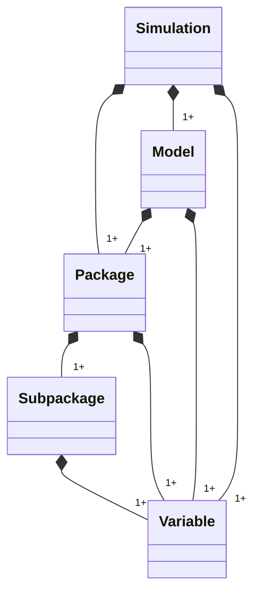

# FloPy 4 software design description (SDD)

<!-- START doctoc generated TOC please keep comment here to allow auto update -->
<!-- DON'T EDIT THIS SECTION, INSTEAD RE-RUN doctoc TO UPDATE -->

- [Conceptual model](#conceptual-model)
- [Object model](#object-model)
- [IO](#io)

<!-- END doctoc generated TOC please keep comment here to allow auto update -->

This is the Software Design Description (SDD) document for FloPy 4, also called *the product*.

This document describes a tentative design, focusing on functional requirements. Some attention may be given to architecture, but non-functional requirements are largely out of scope.

## Conceptual model

This document follows MODFLOW 6 terminology where applicable, with modifications/translations where appropriate.

A MODFLOW 6 simulation is as a hierarchy of modular **components**. Components encapsulate related data and functionality. 

Components may have zero or more user-specified **variables** &mdash; we use this term interchangeably with **field**, with the latter preferred due to "variable"'s genericity. A field might be a model parameter, e.g. a numeric scalar or array value. Fields which configure non-numerical features of the simulation are called **options**. A field can be required or optional.

Components come in several subtypes:

- **simulation**: the fundamental "unit of work" in MF6, consisting of 1+ (possibly coupled) hydrologic process(es)
- **model**: a simulated hydrological process
- **package**: a subcomponent of a model or simulation

The simulation is the root of the tree, with models and packages under it, each of which itself might have other packages.

Most components must have one particular parent (e.g., models are children of a simulation), but some relax this requirement.

Packages come in several flavors, not necessarily mutually exclusive.

- A **stress package** represents a forcing.
- A **basic package** contains only input variables applying statically to the entire simulation.
- An **advanced package** contains time-varying input variables.
- Most packages are singular &mdash; the parent component may have one and only one instance. When arbitrarily many are permitted, the package is called a **multi-package**.
- A **subpackage** is a package whose parent is another package.


```mermaid
classDiagram
    Simulation *-- "1+" Package
    Simulation *-- "1+" Model
    Simulation *-- "1+" Variable
    Model *-- "1+" Package
    Model *-- "1+" Variable
    Package *-- "1+" Subpackage
    Package *-- "1+" Variable
    Subpackage *-- "1+" Variable
```

Components are specified by **definition files**. A definition file specifies a single component and its fields. A definition file consists of top-level metadata and a collection of **blocks**. A block is a named collection of fields. A component may contain zero or more blocks. Each block must contain at least one variable. Most components will have a block named "Options" &mdash; see the [MODFLOW 6 DFN file specification](https://modflow6.readthedocs.io/en/latest/_dev/dfn.html) for more info.

## Object model

The product's main use cases will include creating, manipulating, running, and inspecting MODFLOW 6 simulations. It is natural to provide an object-oriented interface in which every MF6 component module will generally have a corresponding class.

There are many ways to implement an object model in Python: dictionaries, named tuples, plain classes, `dataclasses`, etc.

Two requirements in particular motivate the design described below: 1) the object model is a tree, and 2) it must be self-describing.

Component classes must provide access to both **specification** and **data** &mdash; form and content, respectively. A component's specification should be legible from its class definition, to people and programs.

Moreover, MODFLOW 6 components are situated in a hierarchy, with the simulation at the root, a branch for each model, and so on for packages, etc. This is true of both specification and data &mdash; the specification tree defines how components may be connected together, while a simulation instantiates some subset of the specification. 

A third motivation is consistency with [`imod-python`](https://github.com/Deltares/imod-python), which the product follows in several ways including:

- Using [`xarray`](https://docs.xarray.dev/en/stable/index.html) for the underlying data model
- Providing dictionary-style access and modification

Components in `imod-python` encode parent/child relations in a dictionary, which is filtered as needed for subcomponents of a particular type. The structure of a simulation (or of any component with respect to its children) is thus flexible. "Structural" checks (i.e., what may be attached to what?) run in a separate validation step. 

The product aims instead for typed components, where children can be read off the class definition. This pulls structural validation from runtime to type-checking time, so invalid arrangements are visible in e.g. IDEs with Intellisense.

The product adopts the standard library `dataclasses` paradigm for class definitions. The `dataclasses` module is derived from a project called [`attrs`](https://www.attrs.org/en/stable/) with [more power](https://threeofwands.com/why-i-use-attrs-instead-of-pydantic/). `attrs` permits terse class definitions, e.g.

```python
from flopy.mf6.gwf import Ic
from attrs import define, field
from numpy.typing import NDArray
import numpy as np

@define
class Ic(Package):
    """Initial conditions package"""
    strt: NDArray[np.floating] = field(...)
    export_array_ascii: bool = field(...)
    export_array_netcdf: bool = field(...)
```

Minimal class definitions are easier to read and to generate from definition files. The trick is in mapping the MODFLOW 6 input specification to the Python type system. With this transformation defined, the original specification can be derived in reverse from the class definition.

The product bolts on dictionary-style behavior by implementing `MutableMapping` in a component base class.

Where `imod-python` components expose their fields via [a `Dataset`](https://github.com/Deltares/imod-python/blob/master/imod/common/interfaces/ipackagebase.py), components in the product expose a `DataTree` node. The [`DataTree`](https://docs.xarray.dev/en/stable/generated/xarray.DataTree.html) is a recently developed `xarray` feature implementing [a hierarchical data store](https://docs.xarray.dev/en/stable/user-guide/hierarchical-data.html). Components in the product are an [experimental hybrid](https://github.com/modflowpy/xattree) of `attrs` and `xarray` where `attrs` properties, as well as parent/child references, are proxied through the `DataTree`.

Combining `attrs` and `xarray` in this way presents challenges involving duplication (`xarray` prefers copies to in-place updates) and synchronization. Some careful management of parent/child links is still required, even though `DataTree` does the majority of the work.

The sparse, record-based list input format used by MODFLOW 6 is also in some tension with `xarray`, where it is natural to disaggregate tables into an array for each constituent column &mdash; this requires a nontrivial mapping between data as read from input files and the values eventually accessible through `xarray` APIs.

## IO

IO is at the boundary of the product. Details of any particular input or output format should not contaminate the product's object model.

The product provides an IO framework with which de/serializers can be registered for arbitrary components and formats.

The product will allow IO to be configured globally, on a per-simulation basis, or at read/write time via method parameters.

IO is implemented in several layers:

- IO operations, implemented as descriptors, backing `load` and `write` methods on the base component class
- `cattrs` converters to map the object model to/from Python primitives and containers (i.e. un/structuring)
- Encoders/decoders for any number of serialization formats, which translate primitives/containers to strings

In particular, the product will implement a conversion layer and a serialization layer for the MODFLOW 6 input file format. The serialization layer implements a file writer via `Jinja2` templates and a file parser via a `lark` parser generated from an EBNF language specification.
