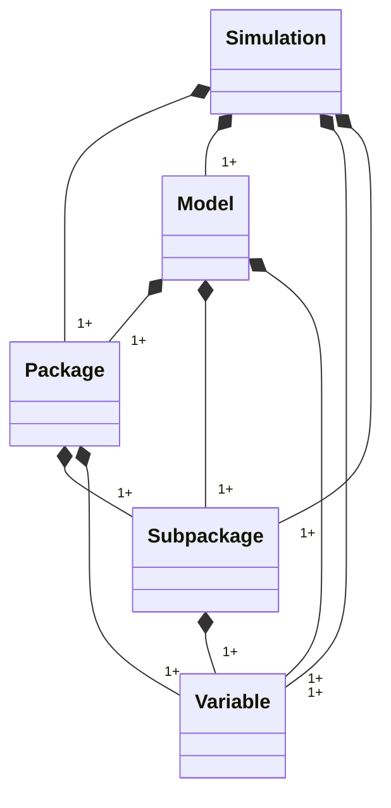
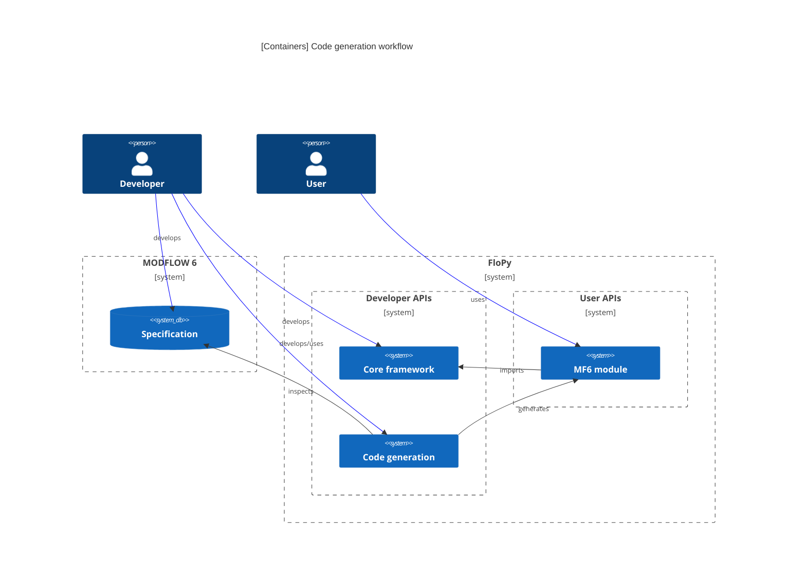

# FloPy 4 software design description (SDD)

<!-- START doctoc generated TOC please keep comment here to allow auto update -->
<!-- DON'T EDIT THIS SECTION, INSTEAD RE-RUN doctoc TO UPDATE -->

- [Conceptual model](#conceptual-model)
- [Object model](#object-model)
  - [`attrs`](#attrs)
  - [`xarray`](#xarray)
  - [`attrs` + `xarray`](#attrs--xarray)
- [Data types](#data-types)
  - [Records](#records)
  - [Unions](#unions)
  - [Arrays](#arrays)
  - [Lists](#lists)
- [Developer workflow](#developer-workflow)
- [IO](#io)
  - [Reading input files](#reading-input-files)
  - [Writing input files](#writing-input-files)
  - [Reading output files](#reading-output-files)

<!-- END doctoc generated TOC please keep comment here to allow auto update -->

This is the Software Design Description (SDD) document for FloPy 4, also called *the product*.

This document describes a tentative design, focusing on "core" functional requirements. Some attention may be given to architecture, but non-functional requirements are largely out of scope here.

## Conceptual model

This document follows MODFLOW 6 terminology where applicable, with modifications/translations where appropriate.

MODFLOW 6 is designed as a hierarchy of modular **components**.

Components encapsulate related functionality and data. Components may have user-specified configuration and/or data **variables**.

Most components must have one particular parent (e.g., models are children of a simulation), but some relax this requirement.

Component types include:

- **simulation**: MF6's "unit of work", consisting of 1+ (possibly coupled) hydrologic processes
- **model**: a simulated hydrological process
- **package**: a subcomponent of a model or simulation

Certain subsets of packages have distinguishing characteristics. A **stress package** represents a forcing. A **basic package** contains only input variables applying statically to the entire simulation. An **advanced package** contains time-variable (i.e. transient) input data. Usually only a single instance of a package is expected &mdash; when arbitrarily many are permitted, the package is called a **multi-package**. A **subpackage** is a concept only recognized by the product, not by MODFLOW 6 &mdash; a package linked to its parent not by a separate input file, but directly (i.e., subpackage data provided to the parent's initializer method). Subpackages may be attached to packages, models, or simulations.

```mermaid
classDiagram
    Simulation *-- "1+" Package
    Simulation *-- "1+" Model
    Simulation *-- "1+" Variable
    Simulation *-- "1+" Subpackage
    Model *-- "1+" Package
    Model *-- "1+" Subpackage
    Model *-- "1+" Variable
    Package *-- "1+" Subpackage
    Package *-- "1+" Variable
    Subpackage *-- "1+" Variable
```

Components are specified by **definition files**. A **definition** specifies input variables for a single MF6 component. A **block** is a named collection of input variables. A definition file specifies exactly one component. A component may contain zero or more blocks. Each block must contain at least one variable.

## Object model

The product's main use cases will include creating, manipulating, running, and inspecting MODFLOW 6 simulations (FUNC-3, FUNC-4). It is natural to provide an object-oriented interface in which every MF6 component module will generally have a corresponding class.

Component classes will provide access to both **specification** and **data** &mdash; that is, to **form** and **content**, respectively. It should be straightforward to read a component's specification off its class definition, or to inspect it programmatically (FUNC-21). Likewise it should be easy to retrieve the value of a variable from an instance of a component (FUNC-4).

There are many ways to implement an object model in Python: dictionaries, named tuples, plain classes, `dataclasses`, etc. There are fewer options if the object model must be self-describing.

### `attrs`

`dataclasses` are derived from an older project called [`attrs`](https://www.attrs.org/en/stable/) which has  [extra powers](https://threeofwands.com/why-i-use-attrs-instead-of-pydantic/).

Our first proof of concept demonstrated a nested hierarchy of hand-rolled classes forming a component tree. Each component stored its data in-house. The specification was attached via metaclass magic.

We propose to follow the same general pattern, using `attrs` instead for introspection and data access.

### `xarray`

XArray provides abstractions for working with multiple datasets related in a hierarchical context, some of which may share the same spatial/temporal indices and/or coordinate systems. 

We propose to follow [imod-python](https://github.com/Deltares/imod-python) in adopting [xarray](https://docs.xarray.dev/en/stable/index.html) as our components' onboard data store.

### `attrs` + `xarray`

Combining these patterns naively would result in several challenges, involving duplication, synchronization, and a more general problem reminiscent of [object-relational impedance mismatch](https://en.wikipedia.org/wiki/Object%E2%80%93relational_impedance_mismatch), where the list-oriented and array-oriented paradigms conflict.

Ultimately, we'd like a mapping between an abstract hierarchy of components and variables, as defined in MF6 definition files, to a Python representation which is self-describing (courtesy of `attrs`) and self-aligning (courtesy of `xarray`).

The [`DataTree`](https://docs.xarray.dev/en/stable/generated/xarray.DataTree.html) is a recently developed `xarray` extension, now in the core package, which provides [many of the features we want from a hierarchical data store](https://docs.xarray.dev/en/stable/user-guide/hierarchical-data.html).

## Data types

MODFLOW 6 defines a [type system for input variables](https://github.com/MODFLOW-USGS/modflow6/tree/develop/doc/mf6io/mf6ivar#variable-types). We adapt this for Python.

A variable is either a scalar or a composite.

Scalars include integer, double precision, boolean, string, and path types. The product can represent scalars as builtin Python primitives.

Composites include array, list, product (record), and sum (union) types.

Translating from MF6:

- A "keystring" is a union. 
- A "recarray" is a list. 

MF6 places some constraints on composite variables. These are explained below.

### Records

MODFLOW 6 requires that records contain only scalar fields. A record may not contain another record.

In MF6 input files, a record appears as a whitespace-delimited line of text. While in principle a record's fields are named, MF6 may or may not expect particular values to be "tagged" (as indicated in definition files). "Tagging" is a concern of the product's MF6 IO layer, not the core object model.

We expect the product to represent records as full-fledged `attrs` classes.

### Unions

MODFLOW 6 requires that unions contain only records. Unions may not contain scalars directly. A union may not contain another union.

To represent unions, the product can simply use `typing.Union`.

### Arrays

MODFLOW 6 supports N-dimensional arrays of homogeneous (scalar) type, where 1 <= N <= 3.

We can accept any `numpy.typing.ArrayLike` value, whether a standard `ndarray` or some other flavor (i.e. "duck arrays"). A common case will be lazy (e.g. dask) arrays for larger-than-memory operations. We can [implement custom array-likes](https://numpy.org/doc/stable/user/basics.interoperability.html) if there is a good case for it.

Arrays can be type hinted in full detail in component classes, e.g. `NDArray[np.floating]`, while methods can generally have more lenient type hints (e.g. `ArrayLike`) and perform any necessary type checks at runtime.

### Lists

MODFLOW 6 lists may contain records or unions of records. Lists may not contain raw scalars. Collections of scalars should be provided as arrays.

A list of records is regular, i.e. tabular. A list of unions can be irregular (i.e. rows can have different element counts) and cannot be treated as tabular data.

For instance:

- A `packagedata` block is typically a list of records of a single type (thus regular/tabular).
- A `period` block is typically a list of unions, where each item may be a different record type (thus irregular).

The product can accept regular list data as Python builtin collections, NumPy arrays of dtype `np.object_`, `xarray.DataArray` or other duck arrays, or tabular data structures, e.g. `np.recarray`, `pd.DataFrame`.

**Note**: If storing a regular list in a tabular data structure, the product should avoid columns of dtype `np.object_` &mdash; e.g. prefer to store grid cell indices as separate columns `i`, `j`, `k`, not a single column.

The product can accept irregular lists as builtin collections, NumPy arrays of dtype `np.object_`,  or `xarray.DataArray` or other duck arrays.

## Developer workflow

The product is a core element in day-to-day MODFLOW 6 development. Most critically, the product must be able to generate a MODFLOW 6 interface layer from a specification (FUNC-20).

Typically, a MODFLOW 6 developer will write a new component specification and module in MODFLOW 6, run the product's code-generation utilities, and use the regenerated MODFLOW 6 interface layer to write integration tests for the ew component.

```mermaid
C4Container
  title [Containers] Code generation workflow

    Boundary(mf6, "MODFLOW 6"){
      SystemDb(dfn, "Specification")
    }

    Boundary(flopy, "FloPy") {
      Boundary(devs, "Developer APIs") {
        System(fpycore, "Core framework")
        System(fpycodegen, "Code generation")
      }
      Boundary(users, "User APIs") {
          System(fpymf6, "MF6 module")
      }
      Rel(fpymf6, fpycore, "imports")
    
      Rel(fpycodegen, dfn, "inspects")
      Rel(fpycodegen, fpymf6, "generates")
    }

    Person(dev, "Developer", "")
    Person(user, "User", "")

    Rel(dev, dfn, "develops")
    Rel(dev, fpycore, "develops")
    Rel(dev, fpycodegen, "develops/uses")
    Rel(user, fpymf6, "uses")
    UpdateRelStyle(dev, dfn, $lineColor="blue", $offsetX="-20" $offsetY="-30")
    UpdateRelStyle(dev, fpycore, $lineColor="blue", $offsetY="90")
    UpdateRelStyle(dev, fpycodegen, $lineColor="blue", $offsetY="50")
    UpdateRelStyle(user, fpymf6, $lineColor="blue", $offsetY="50")
    UpdateRelStyle(user, fpycore, $lineColor="blue", $offsetX="-20" $offsetY="-10")

```

From the MODFLOW 6 developer's perspective, the product's code generation workflow will remain more or less unchanged.

We propose a few changes to the underlying implementation: 

1. Use `Jinja2` for code generation
2. Keep the specification in MODFLOW 6 only
3. Distribute the specification with MODFLOW 6

Item 1 is an implementation detail.

Item 2 will deduplicate the MODFLOW 6 specification and reduce the maintenance/synchronization burden for the product's developers.

Item 3 will allow the product to generate a corresponding MODFLOW 6 interface layer when a new MF6 executable is installed.

## IO

TODO

### Reading input files

### Writing input files

### Reading output files

