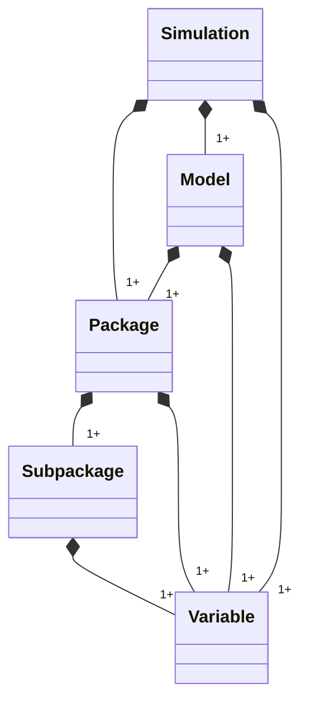

# FloPy 4 software design description (SDD)

<!-- START doctoc generated TOC please keep comment here to allow auto update -->
<!-- DON'T EDIT THIS SECTION, INSTEAD RE-RUN doctoc TO UPDATE -->


- [Conceptual model](#conceptual-model)
- [Object model](#object-model)
  - [Design](#design)
  - [Data model](#data-model)
    - [Protocol architecture](#protocol-architecture)
    - [Dimension resolution](#dimension-resolution)
    - [Migration from xattree](#migration-from-xattree)
  - [Conventions](#conventions)
- [IO](#io)
  - [Input](#input)
    - [Unified IO](#unified-io)
    - [Conversion](#conversion)
    - [Serialization](#serialization)
      - [Writer](#writer)
      - [Reader](#reader)
  - [Output](#output)

<!-- END doctoc generated TOC please keep comment here to allow auto update -->

This is the Software Design Description (SDD) document for FloPy 4, also called *the product*.

This document describes a tentative design, focusing on functional requirements. Some attention may be given to architecture, but non-functional requirements are largely out of scope.

## Conceptual model

This document follows MODFLOW 6 terminology where applicable, with modifications/translations where appropriate.

A MODFLOW 6 simulation is as a hierarchy of modular **components**. Components encapsulate related data and functionality.

Components may have zero or more user-specified **variables** &mdash; the product calls these **field**, as the latter is more conventional in the Python world. A field might be a numeric parameter, e.g. a scalar or array value, or a configuration value. Fields which configure non-numerical features of the simulation are called **options**. A field may or may not be mandatory.

The fundamental component flavors are

- **simulation**: MF6's "unit of work", consisting of 1+ models, possibly coupled
- **model**: a simulated hydrological process, possibly coupled to others
- **package**: a subcomponent of a simulation, model, or package

The simulation is the root of a tree whose internal nodes are models and whose leaves are packages. A package is not necessarily a leaf; packages may have packages as children.

Most components have only one possible parent (e.g., models are children of the simulation), but some relax this requirement.

There are several special kinds of package, not necessarily mutually exclusive.

- A **stress package** represents a forcing
- A **basic package** contains only input variables applying statically to the entire simulation
- An **advanced package** contains time-varying input variables
- A **subpackage** is a package whose parent is another package


```mermaid
classDiagram
    Simulation *-- "1+" Package
    Simulation *-- "1+" Model
    Simulation *-- "1+" Variable
    Model *-- "1+" Package
    Model *-- "1+" Variable
    Package *-- "1+" Subpackage
    Package *-- "1+" Variable
    Subpackage *-- "1+" Variable
```

Components are specified by **definition files**. A definition file specifies a single component and its fields. A definition file consists of top-level metadata and **blocks** (named collections) of variables. A component may contain zero or more blocks. Each block must contain at least one variable. Most components will have a block named "options" &mdash; see the [MODFLOW 6 DFN file specification](https://modflow6.readthedocs.io/en/latest/_dev/dfn.html) for more info.

## Object model

The product's main use cases include creating, manipulating, running, and inspecting MODFLOW 6 simulations. It is natural to provide an object-oriented interface in which every MF6 component module will generally have a corresponding class.

There are many ways to implement an object model in Python: dictionaries, named tuples, plain classes, `dataclasses`, etc.

Two requirements in particular motivate the design described below: 1) the object model is a tree, and 2) it must be self-describing.

Component classes must provide access to both **specification** and **data** &mdash; form and content, respectively. A component's specification should be legible from its class definition, to people and programs.

Moreover, MODFLOW 6 components are situated in a hierarchy, with the simulation at the root, a branch for each model, and so on for packages, etc. This is true of both specification and data &mdash; the specification tree defines how components may be connected together, while a simulation instantiates some subset of the specification.

A third motivation is consistency with [`imod-python`](https://github.com/Deltares/imod-python), which the product follows in several ways including:

- Using [`xarray`](https://docs.xarray.dev/en/stable/index.html) for the underlying data model
- Providing dictionary-style access and modification

Components in `imod-python` encode parent/child relations in a dictionary, which is filtered as needed for subcomponents of a particular type. The structure of a simulation (or of any component with respect to its children) is thus flexible. "Structural" checks (i.e., what may be attached to what?) run in a separate validation step.

The product aims instead for typed components, where children can be read off the class definition. This pulls structural validation from runtime to type-checking time, so invalid arrangements are visible in e.g. IDEs with Intellisense.

### Design

Where `imod-python` components expose their fields via [a `Dataset`](https://github.com/Deltares/imod-python/blob/master/imod/common/interfaces/ipackagebase.py), the product will adopt the `dataclasses` paradigm for class definitions, and will expose `xarray` views. The `dataclasses` module is derived from a project called [`attrs`](https://www.attrs.org/en/stable/) with [more power](https://threeofwands.com/why-i-use-attrs-instead-of-pydantic/). `attrs` permits terse class definitions, e.g.

```python
from flopy.mf6.gwf import Ic
from attrs import define, field
from numpy.typing import NDArray
import numpy as np

@define
class Ic(Package):
    """Initial conditions package"""
    strt: NDArray[np.float64] = field(...)
    export_array_ascii: bool = field(...)
    export_array_netcdf: bool = field(...)
```

`attrs` fields will serve as the single source of truth for component data. `xr.Dataset` and `xr.DataTree` objects can be constructed when needed, providing hierarchical data access. Components can declare dimension capabilities explicitly via protocols, with shared functionality provided through mixins implementing the protocols.

This explicit avoids the complexity and performance issues of the current experimental approach ([`xattree`](https://github.com/wpbonelli/xattree)) which proxies `attrs` properties through `DataTree`. The proposed architecture will provide better type safety, clearer semantics, and improved IDE support while maintaining compatibility with `xarray` conventions.

This approach will keep class definition minimal, easy to read, and easy to generate from definition files. The trick is in mapping the MODFLOW 6 input specification to the Python type system. With this transformation defined, the original specification can be derived in reverse from the class definition.

The product bolts on dictionary-style behavior by implementing `MutableMapping` in a component base class.

The sparse, record-based list input format used by MODFLOW 6 is in some tension with `xarray`, where it is natural to disaggregate tables into an array for each constituent column &mdash; this requires a nontrivial mapping between data as read from input files and the values eventually accessible through `xarray` APIs.

### Data model

Component classes must manage dimensions for array fields and provide `xarray` views of their data. The product uses a protocol-based architecture emphasizing explicitness over implicit behavior.

#### Protocol architecture

Rather than relying on decorator magic that "steals from `__dict__`," the product defines capabilities via runtime-checkable protocols:

**Dimension management protocols**:
- `DimensionProvider`: Components declare what dimensions they provide (e.g., DIS provides `nlay`, `nrow`, `ncol`, `nodes`)
- `DimensionRegistry`: Components resolve dimensions from their hierarchy by walking the object graph

**Xarray conversion protocols**:
- `DatasetConvertible`: Leaf components provide `to_dataset()` for single-level views
- `DataTreeConvertible`: Hierarchical components provide `to_datatree()` for nested views

Protocols enable static type checking while keeping implementations flexible. Components opt-in to capabilities by implementing the relevant protocol.

#### Dimension resolution

Dimensions are resolved lazily at runtime rather than registered eagerly. When a component needs a dimension value:

1. Check the local cache
2. Walk child components to find `DimensionProvider`s
3. If not found, delegate to parent
4. Cache the result

This approach is construction-order agnostic, working whether components are built top-down (loading from files) or bottom-up (interactive construction). Parent references enable walking up the hierarchy, while the cache prevents repeated tree traversals.

Grid discretization packages (DIS, DISV, DISU) and temporal discretization (TDIS) implement `DimensionProvider`, computing both explicit dimensions (from DFN fields like `nlay`) and derived dimensions (like `nodes = nlay * nrow * ncol`).

All components implement `DimensionRegistry` via a mixin, giving uniform resolution behavior throughout the hierarchy. Any component can resolve dimensions on demand.

#### Migration from xattree

The product is migrating away from the experimental [`xattree`](https://github.com/wpbonelli/xattree) decorator, which proxies `attrs` fields through `xarray.DataTree`. While conceptually sound, `xattree` has implementation issues: preventing slotted classes, slow dimension lookups, and poor type-checking support.

The migration maintains backward compatibility through transitional `.data` properties while moving toward:

- `attrs` fields as the single source of truth (no proxying)
- On-demand `xarray` view construction via conversion protocols
- Explicit dimension resolution through protocols and mixins
- Better IDE support and static type checking

This refactor proceeds incrementally, allowing gradual adoption without breaking existing code. See [issue #167](https://github.com/modflowpy/pyphoenix-project/issues/167) for the complete refactor plan.

### Conventions

Being based on `xarray`, the product can support the [MODFLOW 6 NetCDF specification](https://github.com/MODFLOW-ORG/modflow6/wiki/MODFLOW-NetCDF-Format) via `xarray` extension points: custom indices and accessors.

Different "views" of the same underlying components may be provided for each relevant convention through these extension points.

The product can define a custom index and accessor (e.g. `.grid`) providing a structured grid specification. The product can adopt the [`xugrid` library](https://github.com/Deltares/xugrid) for UGRID support.

While custom indices will enable indexing and selection directly on datasets, the accessors can provide utilities for plotting, export, etc. For instance, `xugrid` provides a [`.to_netcdf()` function](https://deltares.github.io/xugrid/api/xugrid.UgridDatasetAccessor.to_netcdf.html). Selecting the scheme in which to write simulation input files then reduces simply to calling `.to_netcdf()` through the appropriate accessor.

## IO

IO is at the product's boundary. Details of any input or output format should not be coupled to the object model.

### Input

Input file IO is implemented in three layers:

1. **Unified IO layer**: Registry and descriptors implementing `load` and `write` methods on the base `Component` class
2. **Conversion layer**: Uses `cattrs` to map the object model to/from Python primitives and containers (i.e. un/structuring)
3. **Serialization layer**: Format-specific encoders/decoders translating primitives and containers to/from strings or binary data

#### Unified IO

The `flopy4.uio` module provides a pluggable IO framework adapted from [`astropy`](https://github.com/astropy/astropy/tree/main/astropy/io). A global `Registry` maintains mappings from `(component_class, format)` pairs to load and write functions. The `Component` base class implements user-facing `load` and `write` methods via descriptors which dispatch functions in the registry.

Loaders and writers can be registered for any component class and format. The registry supports inheritance: a loader/writer registered for a base class is available to all subclasses. The user may then select a format at call time.

#### Conversion

The conversion layer uses `cattrs` to transform between the product's `xarray`/`attrs`-based object model and plain Python data structures suitable for serialization. This layer is format-agnostic and handles structural transformations common across formats.

**Unstructuring (write time)**: A `cattrs` converter with appropriate unstructuring hooks converts components to a form suitable for serialization, handling transformations like:

- Grouping fields into blocks according to their `block` metadata from DFNs
- Converting child components to binding tables for parent component name files
- Slicing time-varying arrays by stress period, returned in a period-indexed `dict`
- Converting `Path` objects to tuples (`<name>`, `FILEIN`/`FILEOUT`, `<path>`)

The unstructuring phase aims to avoid a) unnecessary copies and b) materializing data in memory.

**Structuring (load time)**: A `cattrs` converter with appropriate structuring hooks converts dictionaries of primitives into component instances. This solves several challenges:

*Dimension resolution during initialization*: Array converters need dimensions during `__init__()` before all fields are assigned—a bootstrapping problem. The solution uses a context manager (`DimContext`) with thread-safe `contextvars` to provide dimensions extracted from parsed data, child components, and parent context. Array converters check this context when resolving dimensions.

*Universal array conversion*: The array structuring converter accepts multiple input formats to support both file loading and interactive construction:

- Dictionaries with fill-forward semantics for stress periods or layers
- Nested lists (any depth, validated by shape)
- Duck arrays (`xarray.DataArray`, `numpy.ndarray`, sparse arrays)
- Scalars (broadcast to full shape)
- DataFrames (from round-trip via `stress_period_data` property)

*Grid representation flexibility*: Users work with natural representations (structured `(nlay, nrow, ncol)` arrays) while components use grid-agnostic flat representations (`(nodes,)` dimension). The converter automatically reshapes between these representations, supporting both full 3D grids and 2D per-layer arrays.

*Other structuring tasks*:
- Instantiating child components from bindings
- Reconstructing time-varying arrays from period-indexed blocks
- Validating array shapes against expected dimensions
- Setting proper dimension names and coordinates on `xarray` objects

#### Serialization

The serialization layer implements format-specific encoding and decoding. The product minimally aims to implement serializers for the MODFLOW 6 text-based input format and MODFLOW 6 binary output formats.

##### Writer

The writer in `flopy4.mf6.codec.writer` uses [Jinja2](https://jinja.palletsprojects.com/) templates to render unstructured component dictionaries as MF6 input files.

A top-level-template `blocks.jinja` iterates over blocks, calling field macros defined in `macros.jinja`. Macros dispatch on field format (detected via custom Jinja filters) to render:

- **Scalars**: keywords, integers, floats, strings
- **Records**: tuples of values (e.g., file specifications, cell IDs with values)
- **Arrays**: numeric arrays with control records (`CONSTANT`, `INTERNAL`, `OPEN/CLOSE`)
- **Lists**: stress period data, either tabular or keystring format
- **Keystrings**: option records with keyword-value pairs

Custom Jinja filters in `flopy4.mf6.codec.writer.filters` implement field-specific logic.

The writer handles several MF6-specific concerns:
- **Layered arrays**: 3D arrays are chunked by layer for `LAYERED` array input
- **External files**: Large arrays can reference external files via `OPEN/CLOSE`
- **NetCDF output**: Array control records can specify `NETCDF` for array output
- **Fill values**: Sparse data representation elides cells with fill value `DNODATA`

##### Reader

The reader in `flopy4.mf6.codec.reader` uses [Lark](https://lark-parser.readthedocs.io/) to parse MF6 input files into component instances. Loading is implemented as a multi-stage pipeline.

**Parsing**: Lark generates parse trees using a two-level grammar system:

- **Basic grammar**: Minimal grammar recognizing block structure (`BEGIN`/`END` delimiters) with generic tokens
- **Typed grammars**: Component-specific grammars generated for each MF6 component with rules for array control records (`CONSTANT`, `INTERNAL`, `OPEN/CLOSE`), layered arrays, lists, and records

The parser attempts typed grammar first, falling back to basic grammar on failure.

**Transformation**: A tree transformer converts parse trees to Python dictionaries. The transformer bridges an impedance mismatch between DFN files and generated Python classes.

*The mismatch*: DFN files currently conflate two separate concerns:
1. **Structure** (logical model): What variables exist, their types and dimensions
2. **Format** (serialization): How they're serialized in MF6 input files (e.g., tabular layouts, generic record types with keyword discriminators, file record suffixes)

Grammars are generated to faithfully represent DFN structure (including format artifacts), while Python classes are designed for clean structure using natural xarray idioms. The transformer systematically strips format artifacts while preserving semantic structure. See `docs/dev/parser-transformer-patterns.md` for detailed transformation patterns.

*Transformation tasks*: The transformer uses component class metadata (from `attrs`) as its specification, making class definitions the single source of truth:

- Extracts field metadata to identify types (scalar, array, record, list, keyword)
- Maps block names to attribute names
- Strips format artifacts (e.g., `saverecord` + keyword → `save_head` field)
- Unwraps grammar-only wrapper rules introduced to reflect DFN hierarchy
- Creates `xarray.DataArray` objects with proper dimension names cached from field metadata
- Converts structured list records to dicts with column names extracted from grammar rules
- Handles external file references, storing metadata in DataArray attributes
- Preserves binding tuples for recursive resolution

Arrays initially receive generic dimension names (`dim_0`, `dim_1`), then are reconstructed with proper dimension names when field context becomes available. For layered arrays (e.g., `botm` arriving as `(nlay,)` but expanding to `(nlay, nrow, ncol)`), only dimensions matching the array's rank are assigned; full-shape broadcasting happens during structuring.

This "push knowledge into the parser" approach creates more structured parse trees, reducing post-processing complexity and improving error messages.

*Future work*: Separating structural from format content in the DFN specification would simplify or potentially eliminate many transformation patterns.

**Structuring**: The `cattrs` converter (described in the Conversion section) transforms dictionaries into component instances. Before constructing each component, the structurer:

- Maps blocks to attributes using field metadata
- Recursively resolves bindings (loading referenced child components)
- Extracts dimensions from parsed data, children, and parent context
- Sets up `DimContext` with merged dimensions

Child components load recursively, with `DimensionProvider`s (DIS, TDIS) updating the context so subsequent siblings can access their dimensions.

**Binding resolution**: MF6 namefiles reference child components via binding records:
```
BEGIN MODELS
  gwf6  model.nam  modelname
END MODELS
```

The binding resolver maps type strings (`gwf6`) to component classes and recursively loads referenced components. Since loading is recursive, a single `Simulation.load()` call traverses and loads the entire component hierarchy in one pass.

### Output

Binary output readers are provided for binary head and budget output files.

These readers parse the binary formats specified in the MODFLOW 6 documentation and return data as `xarray` structures. The approach is largely borrowed from `imod-python`.

