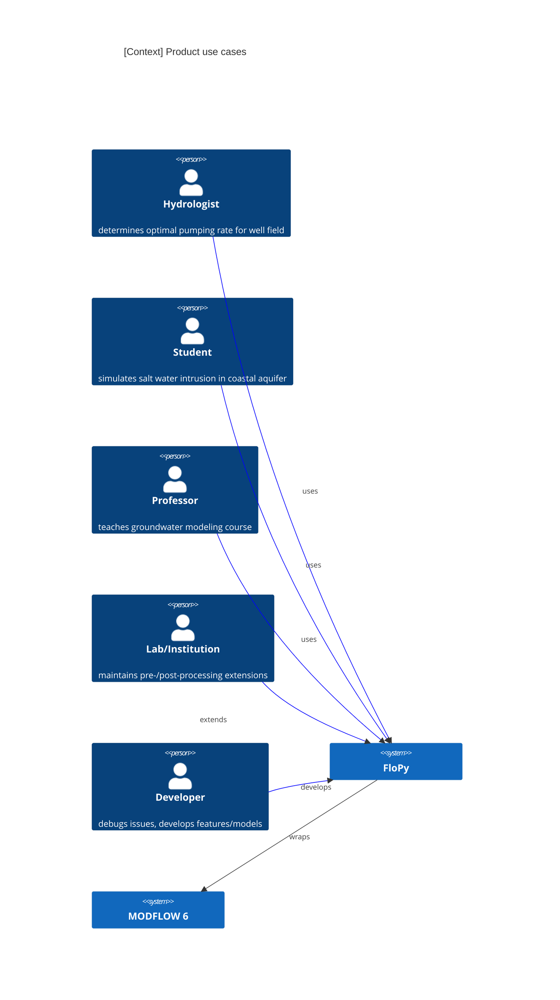
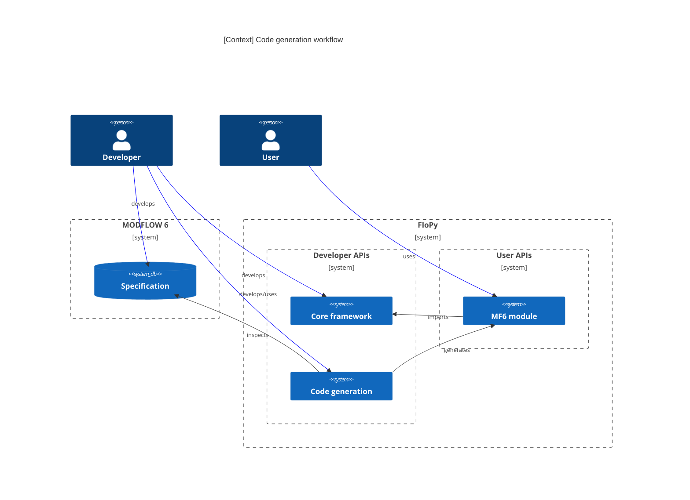

# FloPy 4 software requirement specifications (SRS)

<!-- START doctoc generated TOC please keep comment here to allow auto update -->
<!-- DON'T EDIT THIS SECTION, INSTEAD RE-RUN doctoc TO UPDATE -->

- [Introduction](#introduction)
  - [Product scope](#product-scope)
  - [Product value](#product-value)
  - [Intended audience](#intended-audience)
  - [Intended use](#intended-use)
  - [Use cases](#use-cases)
- [Requirements](#requirements)
  - [Functional requirements](#functional-requirements)
  - [Non-functional requirements](#non-functional-requirements)
  - [System requirements](#system-requirements)

<!-- END doctoc generated TOC please keep comment here to allow auto update -->

## Introduction

This is the Software Requirement Specifications (SRS) document for FloPy 4, also called *the product*.

### Product scope

The product will be able to run MODFLOW simulations.

The product will support pre- and post-processing MODFLOW-based model input and output.

Pre-processing includes tasks like preparing model input and mesh generation.

Post-processing includes tasks like loading model output, plotting/visualiation, rudimentary statistical analysis, and interop with 3rd party formats/tools.

### Product value

The product allows reproducible, versionable Python workflows for MODFLOW modeling applications.

The product wraps MODFLOW and other programs and provide a Pythonic interface to their functionality and input and output files.

The product is essential to the MODFLOW development process for testing existing and newly developed functionality.

### Intended audience

The product is for hydrologic scientists, engineers, and students who are familiar with the Python ecosystem and want to use MODFLOW for their hydrologic applications.

Another key audience is the MODFLOW development team.

### Intended use

The product should be compatible with all major operating systems and hardware ranging from laptops to HPC systems.

The product may be used in standalone scripts, inside applications, from interactive notebooks, and any other common Python runtime.

Other libraries and tools may build upon the product to offer more advanced, domain-specific, or application-specific functionality.

### Use cases

- A hydrologist needs to determine an optimal pumping rate for a well field...

- A student wants to simulate salt water intrusion in a coastal aquifer and visualize results...

- A professor is teaching a groundwater modeling class...

- A hydrologic institute maintains their own suite of advanced pre- and post-processing utilities that can rely on flopy4 as a component for its core capabilities...

- A MODFLOW developer is debugging an issue in the UZF package and wants to create a complicated test with many cells and stress periods...

- A MODFLOW developer is setting up a worked example to demonstrate how to use a new feature...

- A MODFLOW 6 developer writes a new component specification and corresponding module, generates a compatible Python interface, and uses it to write integration tests for the new component...

## Requirements

Broadly, the product should

- preserve existing `flopy.mf6` functionality
- be consistent, user-friendly and pythonic
- be easy to read, debug, diagnose and test
- be memory-efficient and provide fast IO
- separate concerns of users/developers
- impose a minimal maintenance burden

Specific requirements are based on stakeholder interviews and internal research.

Requirements are prioritized according to the [MoSCoW method](https://en.wikipedia.org/wiki/MoSCoW_method), indicating which requirements Must, Should, Could, and Won't be included in the first iteration.

### Functional requirements

| ID      | Description | MoSCoW |
| ------- | ----------- | ------ |
| FUNC-1  | The product can read and write MODFLOW 6 input files, both ASCII and binary. | M |
| FUNC-2  | The product can read MODFLOW 6 output files. | M |
| FUNC-3  | The product can run MODFLOW 6 simulations and provide access to their results. | M |
| FUNC-4  | The product can programmatically create, access, and manipulate MODFLOW 6 simulations. | M |
| FUNC-5  | The product supports existing MODFLOW 6 discretization types and can be extended to support new ones. | M |
| FUNC-6  | The product supports parallel MODFLOW 6 simulations, including requisite pre-processing e.g. model splitting. | M |
| FUNC-7  | The product can plot simulation results with extensible plotting APIs building on popular visualization libraries. | M |
| FUNC-9  | The product can export data to popular data storage/interchange formats (e.g. NetCDF, VTK, geospatial standards. | M |
| FUNC-10 | The product can validate simulations (i.e. check invariants) and warn the user of potential problems before running a simulation. | S |
| FUNC-11 | The product supports extensible/user-defined validations. | C |
| FUNC-12 | The product allows simulation subcomponents to be created independently of parent context, then combined programmatically. | M |
| FUNC-14 | The product can round-trip (i.e. load, write, and run) an existing simulation and give identical results to previous runs. | C |
| FUNC-15 | The product can manage larger-than-memory models and datasets. E.g., the product can be used to create an example model of the United States with a **?1 km?** grid resolution. | M |
| FUNC-16 | The product can determine and report whether it is compatible with a given MODFLOW 6 version (and corresponding specification). | M |
| FUNC-17 | The product is compatible with a wide range of MODFLOW 6 versions (and corresponding specifications) | S |
| FUNC-18 | The product understands and can manage/convert spatial units. | C |
| FUNC-19 | The product understands and can manage/convert temporal units (date and time). | C |
| FUNC-20 | The product can generate a MODFLOW 6 interface layer (i.e. source code) from definition files. | M |
| FUNC-21 | The product's MF6 interface layer can be inspected at runtime, e.g. to discover component attributes and variables. | M |
| FUNC-22 | The product's MF6 interface layer can reproduce the specification used to generate it. | S |
| FUNC-23 | The product provides appropriate, informative string dumps for simulation components. | M |
| FUNC-24 | The product provides programmatic access from any component to any other component registered with the simulation. | S |

### Non-functional requirements

| ID      | Description | MoSCoW |
| ------- | ----------- | ------ |
| NFR-1   | The product's documentation makes a clear distinction between public and internal APIs. | M |
| NFR-2   | The product's documentation provides a complete overview of the definition file specification. | M |
| NFR-3   | The product behaves unsurprisingly, with reasonable defaults for common APIs and use cases. | M |
| NFR-4   | The product provides clear and informative error messages to the user when an error occurs. | M |
| NFR-5   | The product has consistent APIs for MODFLOW 6 and older MODFLOW programs. | S |
| NFR-6   | The product can be easily extended e.g. to support new input/output file formats. | S |
| NFR-7   | The product provides a well-documented, type-hinted public API. | S |
| NFR-8   | The product consolidates entry points and emphasizes API discoverability. | S |

### System requirements

| ID      | Description | MoSCoW |
| ------- | ----------- | ------ |
| SYS-1   | The product complies with scientific-python.org guidelines: <https://scientific-python.org/specs/spec-0000/>. This ensures compatibility with other libraries in the scientific python ecosystem on which the product depends. | M |
| SYS-2   | The product runs on the following operating systems: Windows, Linux, MacOS. | M |
| SYS-3   | The product is available on the Python Package Index (PyPI) and conda-forge. | M |
